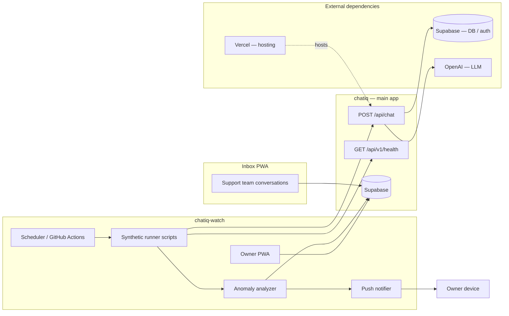

# Watch — architecture

Last updated: 2026-06-15

## System diagram



Full signal list: [`watch-signals.md`](./watch-signals.md).

## Boundaries

### Watch owns

- Synthetic runner (scripts + optional cron route).
- Anomaly detection and scoring (port of `analyze-thai-stress.mjs` logic).
- Owner PWA: last run status, anomaly feed, trends, push subscribe.
- Ops-specific push subscriptions (separate from Inbox conversation alerts).
- Run history tables (or reads them via Supabase service role).

### `chatiq` owns (minimal touch)

- Chat handler, bots, API keys, health endpoint — unchanged behavior.
- **Canary bot(s)** on **ChatIQ Ops** team (config, not new chat code).
- Optional DB migrations for ops tables (`bot_synthetic_runs`, `bot_synthetic_anomalies`, `bot_watch_push_subscriptions`).
- Optional read-only admin APIs — *or* Watch reads ops tables directly with service role.

### Watch does **not** add to `chatiq`

- No stress-test UI in main dashboard.
- No cron routes on the hot chat path.
- No anomaly logic in `handle-chat-requests.ts`.

## Data isolation — teams

| Team | Bots | Inbox / push |
|------|------|--------------|
| **ChatIQ Support** | Prospect/support bots, demos | Day-to-day Inbox PWA |
| **ChatIQ Ops** | Canary / synthetic bots only | Not used for Inbox; optional TTL purge |

Runner env: `BASE_URL`, `API_KEY` (Ops team), `BOT_SLUG` (canary).

Synthetic marker on each run (defense in depth):

```json
{
  "source_detail": {
    "origin": "synthetic",
    "run_id": "<uuid>",
    "scenario": "smoke-th-greeting"
  }
}
```

Requires a small `chatiq` change so the chat route persists this on `bot_conversations` when a runner header or body field is present.

## Anomaly tiers

See [`watch-signals.md`](./watch-signals.md) for per-layer checks. Summary:

### Hard (immediate push)

- **Vercel / app:** HTTP 5xx or timeout on health or canary routes
- **Supabase:** DB/auth path fails (health check or canary persist failure)
- **LLM:** OpenAI error on canary turn; empty response when LLM expected
- **Chat:** Missing `conversationId`; canary API key auth / rate-limit failure; gate invariant break (e.g. booking UX when `booking_mode=off`)

### Soft (push or digest)

- Latency p95 above rolling baseline (app or LLM)
- Platform LLM usage / estimated cost spike vs 7-day average
- Gibberish / quality score ≥ threshold (from existing heuristics)
- Exact duplicate reply groups; language script mismatch
- Failed-turn rate spike vs recent runs

## Tech stack (planned)

Same family as Inbox shell:

- Next.js App Router, React, TypeScript, Tailwind, shadcn/Radix
- Supabase auth (platform `admin` role gate)
- Web Push (VAPID — Watch-specific subscription table)
- Vitest for runner/analyzer unit tests
- GitHub Actions scheduled workflow for Phase 1 runner (before in-app cron)

Local dev default: **port 3002** (Inbox uses 3001).

## Proxy model

Like Inbox, Watch may proxy select requests to `chatiq` for deep links (open a flagged conversation in main dashboard). Most Watch UI reads **ops run tables**, not live Inbox APIs.

## Environment variables (draft)

| Variable | Purpose |
|----------|---------|
| `NEXT_PUBLIC_SUPABASE_URL` | Auth |
| `NEXT_PUBLIC_SUPABASE_ANON_KEY` | Auth |
| `SUPABASE_SERVICE_ROLE_KEY` | Runner writes / PWA server reads ops tables |
| `MAIN_APP_URL` | Proxy + runner target (`https://www.chatiq.io` or staging) |
| `WATCH_API_KEY` | Ops-team canary bot API key |
| `WATCH_BOT_SLUG` | Canary bot slug |
| `CRON_SECRET` | Protect `POST /api/cron/run` when added |
| `VAPID_*` | Watch push |
